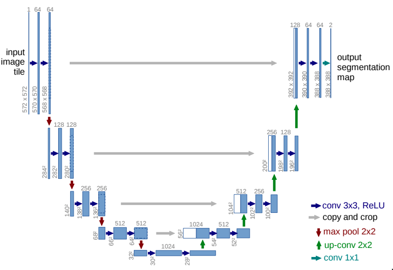
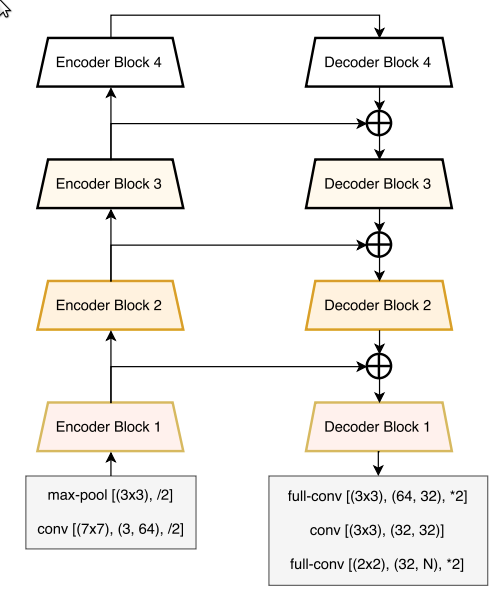
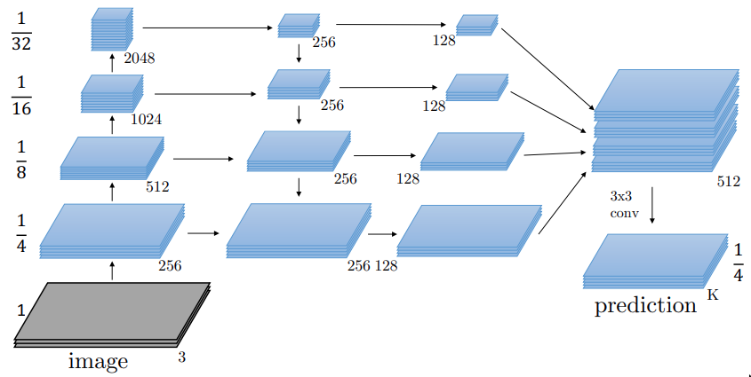
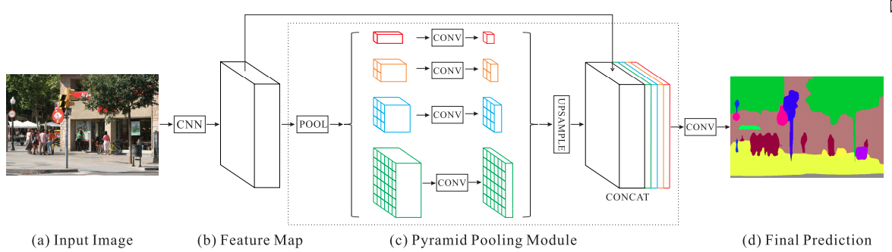
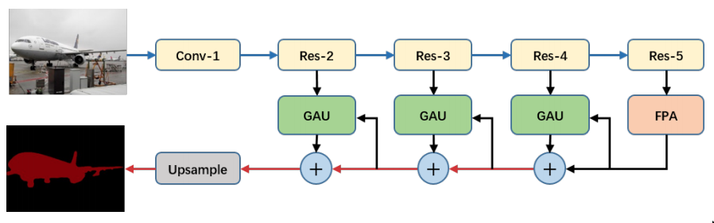
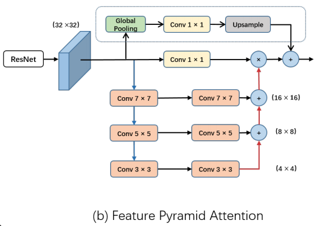
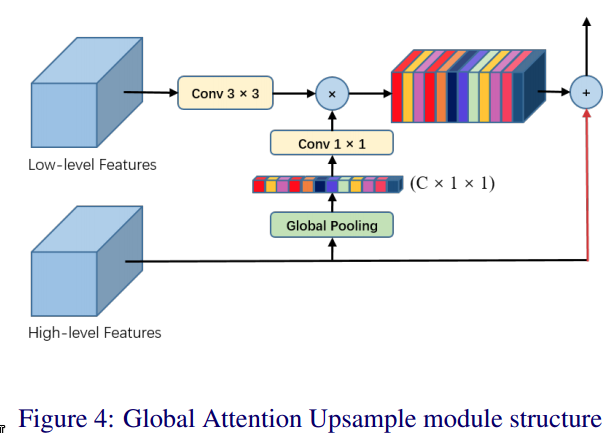
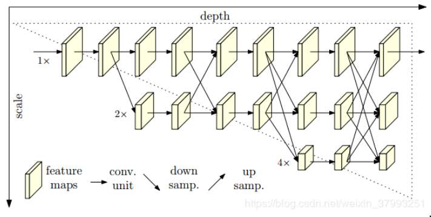

# Image Segmentation
## Source
https://github.com/qubvel/segmentation_models.pytorch

## Model Architectures
1. Unet

   Image Segmentation在深度學習上的始祖，利用autoencoder的架構只是將最後一層改為classification，就能做出圖像語意分割。

   
2. Linknet

    架構以Unet為基礎，並參考Residual Net的概念將down-sampling抽取出來的feature利用相加的方式，加回到up-sampling，並在block之間也有residual的操作，在參數量不增加的情況下能提昇IoU (Interaction of Union)與iIoU。

    
3. FPN
   
    利用Object Detection的FPN架構拿來做Image Segmentation。利用Feature Pyramid來嘗試解決multi-scale產生的問題，也能提高feature的使用率。

    
4. PSPNet

    基於FCN有以下個改良：
    - Pyramid Pooling Module
        
        利用不同大小的average pooling來獲取local和global的context information。
    - Auxiliary Loss
        
        在Residual Block中間多加一個auxiliary loss，其label和最後的label相同，目的是要讓整個model訓練上更穩定。
    
     
5. PAN

    引入attetion的機制，主要是利用high resolution feature map來預測channel mask後對low resolution feature map做相乘，讓高層次的feature來指導低層次的feature。

    
    
    
6. DeepLabV3

    Atrous Convolution = Dilated Convolution
    本篇主要利用Dilated Convolution取代Pooling，來譬免最後結果模糊的問題。

7. HRNet

    相比過往的net，HRNet可以一直維持high resolution，而在中間會增加high-to-low的subnetworks，並且採並聯的方式。 利用反覆且多尺度的融合，能夠維持生成的高解析度。

    