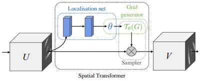

# PPG2ECG 回顧
## Spatial Transformer Network
- Affine Transformation
  $\begin{bmatrix}
     x'\\
     y'\\
  \end{bmatrix} =
  \begin{bmatrix}
     \theta_1, \theta_2, \theta_3\\
     \theta_4, \theta_5, \theta_6
  \end{bmatrix} *
  \begin{bmatrix}
     x\\
     y\\
     1
  \end{bmatrix}$
- Bilinear Interpolation
  利用相鄰四點做插值，因為有可能grid得到的點座標有小數，需要轉換成整數，就利用插值法。

## QRS-complex enhanced loss
- Gaussian distribution
   $
   \frac{1}{\sqrt{2\pi\sigma^2}}e^{-\frac{(x-u)^2}{2\sigma^2}}
   $
- QRS-complex enhanced loss
   $
      L_{QRS}=\sum_{i=1}^{N}\sum_{t=1}^{T}|y_{i,t}-\hat{y}_{i,t}|(1+\beta\sum_{k=1}^{K_i}e^-\frac{(t-c_{i,k})^2}{2\sigma^2})
   $
