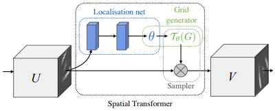
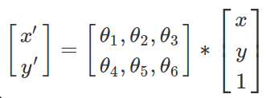
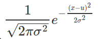
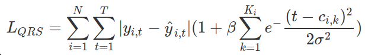

# PPG2ECG 回顧
## Spatial Transformer Network

- Affine Transformation
  
- Bilinear Interpolation
  利用相鄰四點做插值，因為有可能grid得到的點座標有小數，需要轉換成整數，就利用插值法。

## QRS-complex enhanced loss
- Gaussian distribution
   

- QRS-complex enhanced loss
   
